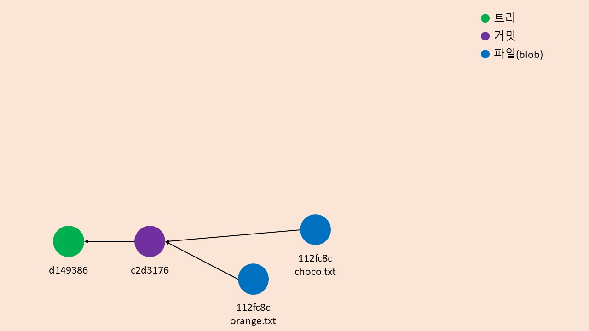

<!-- @format -->

# git은 어떻게 동작하는가?

_기초적인 사용법_

[누구나 쉽게 이해할 수 있는 Git 입문](https://backlog.com/git-tutorial/kr/intro/intro1_1.html)

_다음 코스_

[git 마스터]()

---

## 챕터

## 0. 도입

<br/>

## 1. git이란 무엇인가?

- ### 1.1. Persistent Map
- ### 1.2. Stupid Content Tracker(1) - 커밋(commit)
- ### 1.3. Stupid Content Tracker(2) - git 오브젝트
- ### 1.4. Stupid Content Tracker(3) - 정리
<br/>

## 2. 브랜치와 머지

- ### 2.1. Revision Control System
- ### 2.2. Stupid Content Tracker(1) - 브랜치(branch)
- ### 2.3. Stupid Content Tracker(2) - 머지(merge), 리베이스(rebase)
- ### 2.4. Stupid Content Tracker(3) - 정리

<br/>

## 3. 분산 버전 관리 시스템

- ### 3.1. Distributed Revision Control System(1) - 분산 저장소
- ### 3.2. Distributed Revision Control System(2) - push, 그리고 pull/fetch
- ### 3.3. Distributed Revision Control System(3) - 정리

<br/>

## 4. 마치며

<br/>

---

## 0. 도입

<div style="text-indent :1rem">git이란 무엇인지 생각 해 본 적이 있는가? 영어 사전을 보면 알겠지만 git은 그 자체로 그렇게 좋은 뜻은 아니다. 다음과 같은 것들을 잔뜩 떠올릴 지도 모른다.</div>

```bash
$git clone
$git add
$git commit
$git push
$git pull
$git merge
.....
```

<div style="text-indent :1rem">조금 더 아는 게 많다면 '분산 버전 관리 시스템'정도로 대답할 수도 있을 것이다. 맞는 말이다. 이런 용어는 멋있어 보이지만 굉장히 추상적이라 대상의 본질적인 이해와는 거리가 멀다. 좀 더 근본적인 이해를 위해 본문에서는 git을 마치 여러 층을 가진 양파와 같다고 생각할 것이다.</div>


<div style="margin-bottom : 3rem;  text-align : center"> 양파 단면</div>

<br/>
<div style="text-indent :1rem">좀 더 단순하게 그림으로 표현하자면 아래와 같다.</div>


<div style="margin-bottom : 3rem;  text-align : center"> git 단면도</div>

<br/>
<div style="text-indent :1rem">git은 위처럼 논리적으로 네 개의 계층으로 이루어져있다. 본문에서는 git의 동작방식에 대해 중점적으로 다룰 것이고, git merge나 git reset 등의 키워드 등에 대해서도 알면 좋은 수준(몰라도 된다)에서 설명하겠다.</div>
<br/>

## 1. git이란 무엇인가?

### 1.1. Persistent Map


<div style="margin-bottom : 3rem;  text-align : center"> Persistent Map</div>

<br/>
<div style="text-indent :1rem">먼저 계층의 가장 안쪽인 'Persistent Map'에 대해서 살펴볼 것이다. 이에 대해 먼저 단어부터 짚고 넘어가자. 보통 지속성, 영속성 등으로 번역 되며 컴퓨터 과학에서 Persistent(Persistence)는 보통 프로세스나 컴퓨터가 종료 되어도 그 상태가 유지되는 특성을 의미한다. 대표적으로 하드디스크 등의 미디어를 Persistent Storage라고 분류한다. 살펴보겠지만 git 저장소의 모든 상태와 데이터는 디스크 내 파일로 저장된다. Map은 흔히 우리가 아는 자료구조의 일종으로 데이터와 그 데이터를 식별하는 키로 이루어진 자료구조를 의미한다.</div>


<div style="margin-bottom : 3rem;  text-align : center"> 자료구조 Map</div>

<br/>
<div style="text-indent :1rem">즉, Persistent Map이란 영속성을 지닌(Persistent) Map 자료구조를 의미한다. 이 것이 git의 본질이다. 명확하게 정의하면 git은 SHA1<sup>*</sup> 해쉬 키와 데이터(앞으로 오브젝트라고 부르겠다)로 이루어진 파일 데이터베이스다.</div>

<br/>
<div style="text-indent :2rem; font-size : 0.9rem">* SHA1 : SHA 암호화에 사용되는 해쉬 함수로 2^160 bits 길이의 해쉬 값을 생성해낸다. SHA1 해쉬 값들이 충돌 하려면 대략 로또복권이 1등이 7번 연속 당첨되는 기적이 필요하다.</div>
<br/>
<div style="text-indent :1rem">이를 증명하기 위해 아무 디렉토리나 생성한 뒤 해당 위치에서 터미널을 켜보자. 아래에서 쓰이는  'hash-object'나 'cat-file' 등의 커맨드는 무시해도 좋다. 실전에서는 사용할 일이 없을 것이다.</div>

```bash
$git init
$echo "Choco" > choco.txt
$git add .
$git commit -m "choco.txt 추가"
$git hash-object choco.txt
cb2f8f66a899874fe9fed680ca9a118b56259d67
$git cat-file cb2f8f66a899874fe9fed680ca9a118b56259d67 -p
Choco
```

<div style="text-indent :1rem">보았는가? git은 오브젝트를 SHA1 해쉬로 다루고 그 해쉬로부터 동일한 결과 값을 얻어낼 수 있다. 그리고 이 해쉬 값은 SHA1의 결과값이기 때문에 어떤 컴퓨터에서든 동일하다.</div>


<div style="margin-bottom : 3rem;  text-align : center">git 오브젝트 해쉬 맵</div>

<br/>
<div style="text-indent :1rem">앞으로도 설명 하겠지만 git은 파일 같은 데이터 뿐만 아니라, 커밋이나 태그 같은 것도 전부 이런 방식으로 다룬다. 앞서 언급했듯이 git은 'Persistent Map'이라고 했다. 그렇다면 이 데이터들은 도대체 어디에 있는 것일까?</div>

<div style="text-indent :1rem">대답은 단순하다. 프로젝트의 .git 디렉토리를 열어보자. 그리고 objects 폴더로 가서 cb 폴더로 들어가 보자.  </div>


<div style="margin-bottom : 3rem;  text-align : center">git 오브젝트(Choco)</div>

<br/>
<div style="text-indent :1rem">느낌이 오는가? 폴더, cb의 이름과 내부의 파일, 2f8f66a899874fe9fed680ca9a118b56259d67의 이름을 합치면 "Choco"의 키값인 cb2f8f66a899874fe9fed680ca9a118b56259d67가 나온다. git은 이런 식으로 파일 베이스로 모든 오브젝트를 저장한다. git clone도 그저 이 오브젝트들을 그대로 복사할 뿐이다. 위에서 한 것처럼 파일 몇개를 만들어 커밋하고 objects 폴더를 열어보면 더 확실히 알 수 있다.</div>

<br/>

### 1.2. Stupid Content Tracker(1) - 커밋(commit)


<div style="margin-bottom : 3rem;  text-align : center">Stupid Content Tracker</div>

<br/>
<div style="text-indent :1rem">무슨 용어인지 감도 잡히지 않는다. Stupid Content Tracker? 일단은 개발자인 리누스 토발즈가 git을 정의할 때 쓰는 용어다. git 공식 man 페이지에도 git을 이 용어로 정의한다. 정확한 이유는 알 수 없지만 왜 리누스가 git을 그렇게 부르는지 한 번 추론해보자.</div>


<div style="margin-bottom : 3rem;  text-align : center">git 공식 홈페이지 문서</div>

<br/>
<div style="text-indent :1rem">일단은 커밋에 대해 이해해야한다. 커밋도 git 오브젝트 중 하나라고 한 것을 기억하는가? 그렇다, 커밋도 .git/objects에 저장되는 파일에 불과하다. 커밋이 어떻게 이루어져있는지 정확히 살펴보자. 세부적인 값은 다를 수 있다.</div>

```bash
$mkdir commitSample
$cd commitSample
$git init
$echo "choco">>choco.txt
$echo "orange" >>orange.txt
$git add .
$git commit -m "first"
$git log --oneline
c2d3176 (HEAD -> master) first
#이처럼 해쉬키 앞부분의 일부로 오브젝트를 조회할 수 있다.
$git cat-file c2d3176 -p
tree d149386be66db29689bb4911772c10c4e1c01fd9
author Ray <walrus811@naver.com> 1615528294 +0900
committer Ray <walrus811@naver.com> 1615528294 +0900

first

$git cat-file d149386be66db29689bb4911772c10c4e1c01fd9 -p
100644 blob 112fc8c754c447e50aa26d7a1254bbdf7bd96d3a    choco.txt
100644 blob f8c1e5ce5d035a780880cc7419ff0683187f8497    orange.txt
```

<div style="text-indent :1rem">커밋도 git 오브젝트이기 때문에 해쉬키로 관리되며 'git cat-file'로 그 값을 확인할 수 있다. 해당 파일은 .git/object/c2(커밋의 해쉬키가 c2d3176... 이므로)에서 찾을 수 있을 것이다. 위에서 보면 알겠지만 커밋은 트리(곧 살펴본다), 부모 커밋(아직은 없다), 커밋한 사람, 커밋 메시지 등이 기록된 텍스트 파일에 불과하다.</div>

<div style="text-indent :1rem">여기서 주목할 것은 'tree'다. 말그대로 자료구조인 트리를 의미한다. 커밋은 그에 대응하는 트리 데이터를 가지고 있다. 이를 그림으로 그려나갈 것이다.</div>


<div style="margin-bottom : 3rem;  text-align : center">first 커밋</div>

<br/>
<div style="text-indent :1rem">커밋 "c2d3176"에 대응하는 트리의 구조를 그려보았다. 두번째 커밋을 추가해보자.</div>

```bash
$echo "startbucks" >>starbucks.txt
$git add .
$git commit -m "second"
$git log --oneline
e047be9 (HEAD -> master) second
c2d3176 first
$git cat-file e047be9 -p
tree a618fa83f9bbf954da1ad599c4e3a102fd4b25ba
parent c2d3176316b9350a8e37cfcf363a5a5ef06e34e4
author Ray <walrus811@naver.com> 1615528377 +0900
committer Ray <walrus811@naver.com> 1615528377 +0900

second
#first 커밋 트리
$git cat-file d149386be66db29689bb4911772c10c4e1c01fd9 -p
100644 blob 112fc8c754c447e50aa26d7a1254bbdf7bd96d3a    choco.txt
100644 blob f8c1e5ce5d035a780880cc7419ff0683187f8497    orange.txt
#second 커밋 트리
$git cat-file a618fa83f9bbf954da1ad599c4e3a102fd4b25ba -p
100644 blob 112fc8c754c447e50aa26d7a1254bbdf7bd96d3a    choco.txt
100644 blob f8c1e5ce5d035a780880cc7419ff0683187f8497    orange.txt
100644 blob 9750b188607562dee89858f8152502ae947376cc    starbucks.txt
```

<div style="text-indent :1rem">대응되는 트리가 또 생겼다는 것과 parent라는 항목이 commit에 생겼다는 걸 즉각 눈치챌 수 있을 것이다. parent는 직관적으로 알 수 있듯이 해당 커밋의 직전 커밋을 의미한다. 해쉬키값을 보면 first 커밋과 동일함을 알 수 있다.</div>

<div style="text-indent :1rem">중요한 건 그 다음이다. first의 커밋트리 내의 choco.txt(112fc8c), orange.txt(f8c1e5c)가 second의 커밋트리 내의 대응하는 blob과 동일한 해쉬키값을 가지고 있음을 확인할 수 있다. 이 걸 그림으로 표현하자면 다음과 같다.</div>


<div style="margin-bottom : 3rem;  text-align : center">second 커밋</div>

<br/>
<div style="text-indent :1rem">즉, 새로운 커밋이 만들어졌다고 해당하는 오브젝트의 전체를 새로 만드는 게 아니라. 변화가 없다면 기존 파일(blob)만 새 트리에 레퍼런싱 하는 것이다. 이런 구조를 통해 최대한 커밋 트리를 작게 유지할 수 있다.</div>

<div style="text-indent :1rem">그렇다면 파일을 수정하면 어떻게 될까? 이 때는 새로운 blob 만들어져 아래처럼 된다.</div>

```bash
$echo "late" >> choco.txt
$git add .
$git commit -m "choco.txt modified"
$git log --oneline
2ecdf03 (HEAD -> master) choco.txt modified
e047be9 second
c2d3176 first
$git cat-file 2ecdf03 -p
tree 9a1b3d7e4edb0373389513bb54f4d533f0961fd6
parent e047be920390874d3045484aeca813968fa959e7
author Ray <walrus811@naver.com> 1615528456 +0900
committer Ray <walrus811@naver.com> 1615528456 +0900

choco.txt modified
#second 커밋 트리
$git cat-file a618fa83f9bbf954da1ad599c4e3a102fd4b25ba -p
100644 blob 112fc8c754c447e50aa26d7a1254bbdf7bd96d3a    choco.txt
100644 blob f8c1e5ce5d035a780880cc7419ff0683187f8497    orange.txt
100644 blob 9750b188607562dee89858f8152502ae947376cc    starbucks.txt
#choco.txt modified 커밋 트리
git cat-file 9a1b3d7e4edb0373389513bb54f4d533f0961fd6 -p
100644 blob a8bc0fdac680e61b1331da1b96a7cd92388d2ee0    choco.txt
100644 blob f8c1e5ce5d035a780880cc7419ff0683187f8497    orange.txt
100644 blob 9750b188607562dee89858f8152502ae947376cc    starbucks.txt
```

<div style="text-indent :1rem">이 경우는 그림처럼 새 blob을 만들어낸다.</div>


<div style="margin-bottom : 3rem;  text-align : center">choco.txt modified 커밋</div>

<br/>
<div style="text-indent :1rem">이처럼 커밋은 정보 몇개로 이루어진 텍스트 파일에 불과하고, 그 커밋들이 구성하는 소스의 이력 구조도 단순한 트리에 불과하다.</div>

### 1.3. Stupid Content Tracker(2) - git 오브젝트

<div style="text-indent :1rem">파일, 커밋 전부 단순한 해쉬 키맵 데이터고, git의 다른 오브젝트들도 이렇게 관리된다. 그러면 이 외에 어떤 오브젝트가 있는지도 살펴보자.</div>

<ul>
<li> Blob : 데이터(파일)</li>
<li> Tree : 커밋 트리</li>
<li> Commit : 커밋</li>
<li> Annotated Tag : 태그(오브젝트에 대한 레이블)</li>
</ul>

<div style="text-indent :1rem">Annotated Tag가 낯설다. 다음의 예시를 살펴보자. 보자마자 직관적으로 알 수 있을 것이다.</div>

```bash
$git tag -a "0.1" -m "0.1" #0.1이라는 태그를 현재 커밋에 추가
$git log --oneline
a75ea41 (HEAD -> master, tag: 0.1) choco.txt->cc.txt
2ecdf03 choco.txt modified
e047be9 second
c2d3176 first
$git cat-file 0.1 -p
object a75ea4143cfa38188c14aebbbab69fa85adad3c4
type commit
tag 0.1
tagger Ray <walrus811@naver.com> 1615533630 +0900

0.1
```

<div style="text-indent :1rem">위처럼 git 오브젝트를 설명하는 문자열이라고 보면 된다. 보통은 커밋에 붙어 릴리즈를 구분하는 용도로 사용한다.</div>

<br/>

### 1.3. Stupid Content Tracker(3) - 정리

<div style="text-indent :1rem">그럼 'Stupid Content Tracker'는 무슨 의미일까? 'Content Tracker'는 git이 커밋과 그 트리를 통해 파일의 이력을 관리하기 때문에 명확하다. 'Stupid'는 아마 추측하건대 파일을 관리할 때 별도의 인덱싱이나 복잡한 구조를 쓰지 않고 단순한 트리를 쓰기 때문인 것으로 보인다. 아마 이력 추적의 단순함을 꼬집는 말이 아닐까 싶다. git 저장소는 동작시 현재 지정된 커밋 정보만 알고 있을 뿐 트리 전체가 어떻게 되어있는지 등에 대한 정보는 전혀 모른다. 그냥 필요할 때 커밋파일을 읽어서 트리 내의 커밋들을 순차적으로 추적해나갈 뿐이다.</div>

<div style="text-indent :1rem">굳이 git을 다른 말로 부르자면 '파일 시스템 상에 존재하는 버전 관리가 되는 파일 시스템'정도가 아닐까 싶다.</div>

<div style="text-indent :2rem; font-size : 0.9rem">*리누스 토발즈(Linus Torvalds) : "난 지극히 자기중심적인 놈이고, 모든 내 프로젝트를 나를 따서 이름을 지어. 처음이 'Linux', 지금은 'Git'이지(I'm an egotistical bastard, and I name all my projects after myself. First 'Linux', now 'Git')." </div>
<br/>

<br/>

---

## 2. 브랜치와 머지

### 2.1. Revision Control System


<div style="margin-bottom : 3rem;  text-align : center"> Rivision Control System</div>

<br/>
<div style="text-indent :1rem">그 다음은 Revision Control System이다. git은 파일의 이력추적에 더해 그 이력을 수정하고 이력간에 이동할 수 있는 기능을 여럿 제공한다. revert, reset, branch, checkout, merge, rebase 등이 여기에 관련된 커맨드들이다. 그렇다면 그런 이력 수정에 기초가 되는 브랜치에 대해 먼저 알아보도록 하자.</div>

### 2.2. Revision Control System(1) - 브랜치(branch)

<div style="text-indent :1rem">브랜치(Branch)가 무엇이라고 생각하는가? 소스로부터의 분기 같은 설명도 맞지만 여기서는 조금 더 저수준 에서 git의 브랜치가 무엇인지 파악해보려고 한다. 새로운 프로젝트를 시작해보자.</div>

```bash
$mkdir branch
$cd branch
$git init
$git log
fatal: your current branch 'master' does not have any commits yet
$ls .git/refs/heads
#아무것도 없음
```

<div style="text-indent :1rem">미리 말하자면 브랜치도 파일로서 관리 된다. 즉, .git에 존재한다. 정확히는 .git/refs/heads에 존재한다. 다만, 지금은 아무 커밋도 없기 때문에 해당 디렉토리에 아무 파일도 존재하지 않는다.</div>

```bash
$echo "어제 피자를 먹어버렸어요!" >> day.txt
$git add day.txt
$git commit -m "오늘의 기록"
$git log --oneline
95e968a (HEAD -> master) 오늘의 기록
$ls .git/refs/heads/
master
```

<div style="text-indent :1rem">커밋 해쉬키는 다를 수 있다. 보는 것처럼 처음 커밋하자마자 현재 브랜치 이름에 대응하는 master 파일이 생긴 걸 확인할 수 있다.이 내용은 다음과 같다.</div>

```bash
$git log --oneline
95e968a (HEAD -> master) 오늘의 기록
$cat .git/refs/heads/master
95e968a42725545fc03c7501b30538b1870faa8b
```

<div style="text-indent :1rem">혹시 refs라는 디렉토리 명에서 감을 잡았을지도 모르겠다. 위에서 보듯이 브랜치는 그저 커밋 해쉬키를 저장하고 있는 파일에 불과하다. 적확하게 표현하자면 커밋에 대한 레퍼런스에 불과하다. 조금 더 살펴보자.</div>

```bash
$echo "\r\n오늘은 조금 먹어야해요" >> day.txt
$git add dat.txt
$git commit -m "오늘의 기록2"
$git log --oneline
da36073 (HEAD -> master) 오늘의 기록2
95e968a 오늘의 기록

$cat .git/refs/heads/master
da3607300fc9cd7a6ef6f4737defb040c2db7f31
```

<div style="text-indent :1rem">위에서 보듯이 브랜치는 그저 최신 커밋을 가리키는 레퍼런스에 불과하다. 다른 브랜치도 생성해보자.</div>

```bash
$git branch but-i-eat-more
$git checkout but-i-eat-more
Switched to branch 'but-i-eat-more'
$git log --oneline
da36073 (HEAD -> but-i-eat-more, master) 오늘의 기록2
95e968a 오늘의 기록
$ls .git/refs/heads/
but-i-eat-more  master #새 브랜치 파일이 생겼다
$cat .git/refs/heads/but-i-eat-more
da3607300fc9cd7a6ef6f4737defb040c2db7f31
$echo "그치만 오늘 저녁엔 치킨을 먹을 거야" >>day.txt
$git add day.txt
$git commit -m "치킨을 먹어버렸다."
$git log --oneline
580be18 (HEAD -> but-i-eat-more) 치킨을 먹어버렸다.
da36073 (master) 오늘의 기록2
95e968a 오늘의 기록
$cat .git/refs/heads/but-i-eat-more
580be182a804f5cfb81d9b8782df9d8e0d9eaaf4
$cat .git/refs/heads/master
da3607300fc9cd7a6ef6f4737defb040c2db7f31
```

<div style="text-indent :1rem">다른 브랜치를 생성함으로써 조금 더 명확해졌다. 여기서 지속적으로 등장하는 HEAD가 무엇인지 궁금증을 가질 것이라고 생각한다. 이름 그대로 현재 git 저장소에서 보고 있는 브랜치를 가리키는 레퍼런스다. 아래 예시를 살펴보자.</div>

```bash
$cat .git/refs/heads/but-i-eat-more
580be182a804f5cfb81d9b8782df9d8e0d9eaaf4
$cat .git/refs/heads/master
da3607300fc9cd7a6ef6f4737defb040c2db7f31
$cat .git/HEAD
ref: refs/heads/but-i-eat-more
```

<div style="text-indent :1rem">HEAD 또한 .git/HEAD라는 이름으로 저장되는 파일에 불과하고 안에는 현재 브랜치 파일의 경로만 쓰여있을 뿐이다. 상황을 그림으로 표현하자면 다음과 같을 것이다.</div>


<div style="margin-bottom : 3rem;  text-align : center"> 현재 git 레포지토리 상태</div>

<br/>
<div style="text-indent :1rem">즉, 커밋은 git 오브젝트의 일종으로 커밋에 대한 정보를 담은 파일이고, 브랜치는 해당 브랜치가 현재 어떤 커밋을 참조하는지에 대한 정보를 담은 파일이다. 이에 더해 HEAD는 git 저장소가 현재 가리키는 브랜치에 대한 정보를 담은 파일이다.</div>

<div style="text-indent :1rem">우리가 소스코드 상태를 이전 커밋으로 되돌리거나 브랜치를 변경하는 것도 이런 파일들을 변경하는 것에 불과하다.</div>

<div style="text-indent :2rem; font-size : 0.9rem">*커맨드라인에서 git 커밋이나 브랜치를 참조할 때 tab을 누르면 자동완성이 된다 : 이는 즉, 커밋, blob, 브랜치 등이 파일시스템 내의 파일에 불과하다는 추가적인 증거다. </div>

### 2.3. Revision Control System(2) - 머지(merge)와 리베이스(rebase)

<div style="text-indent :1rem">이제 브랜치에 대해 살펴보았으니, 악명 높은 머지(merge)와 리베이스(rebase)에 대해 알아볼 차례다. 브랜치를 마법이 아니라 고작 커밋 해쉬키를 포함한 레퍼런스 파일에 불과하다고 생각할 수 있다면 이 두 개념도 전혀 어렵지 않다. 아마 본단락을 읽을 필요가 없을지도 모른다.</div>

<div style="text-indent :1rem">git에서는 두 브랜치로부터 소스코드를 병합할 때 두 가지 전략이 존재한다. 바로, 머지와 리베이스다. 먼저 머지부터 살펴본다.</div>

```bash
$git checkout master
$git merge --no-ff but-i-eat-more
$git log --oneline --graph --decorate
*   2808019 (HEAD -> master) Merge branch 'but-i-eat-more'
|\
| * 580be18 (but-i-eat-more) 치킨을 먹어버렸다.
|/
* da36073 오늘의 기록2
* 95e968a 오늘의 기록
$cat .git/HEAD
ref: refs/heads/master
$cat .git/refs/heads/master
28080194aebff59f1039e01bf4f2494a37bf170c
```


<div style="margin-bottom : 3rem;  text-align : center">머지 후</div>

<br/>
<div style="text-indent :1rem">색 다를 건 없다. 머지를 진행하면 새로운 새로운 커밋을 만들 뿐이다. 그리고 HEAD를 머지된 커밋으로 옮길 뿐이다. 다만, merge 커맨드 중 --no-ff가 궁금할 수 있는데, 이 것을 쓰지 않으면 가능한한 새 커밋을 만들지 않는다. 이 가능한 상황을 패스트 포워드(fast-forward)라고 부른다. 패스트 포워드는 머지를 진행 할 때 최신 브랜치가 이전 브랜치를 포함하고 있는 경우에 발생한다. 이 경우, 새 커밋은 만들어지지 않고 대상이 된 브랜치와 HEAD만 변경된다.</div>

```bash
$git reset da36073 --hard #커밋 되돌리기
$git merge but-i-eat-more
$git log --oneline --graph --decorate
* 580be18 (HEAD -> master, but-i-eat-more) 치킨을 먹어버렸다.
* da36073 오늘의 기록2
* 95e968a 오늘의 기록
$cat .git/HEAD
ref: refs/heads/master
$cat .git/refs/heads/master
580be182a804f5cfb81d9b8782df9d8e0d9eaaf4
```


<div style="margin-bottom : 3rem;  text-align : center">패스트 포워드</div>

<br/>
<div style="text-indent :1rem">git은 이처럼 꽤 똑똑하게 동작한다. 이렇게 패스트 포워드를 이용하면 커밋 이력을 깔끔하게 유지할 수 있다. 하지만, 머지 이력이 상실 되고, 정확히 기록이 안된다는 단점이 있다. 그렇기 때문에 머지시 가급적 --no-ff 옵션을 붙지는 것을 추천한다. 하지만 해당 사항은 git을 운용하는 팀의 사정에 따라 다를 것이다.</div>

<div style="text-indent :1rem">리베이스를 설명하기에 앞서 git 저장소의 한 가지 상태를 살펴보자. 바로 'Detached HEAD'라고 불리는 상태인데 정상적인 '브랜치'로부터 접근할 수 없는 커밋을 직접 해쉬코드로 참조(HEAD로 지정)하고 거기서 소스 커밋 등의 작업을 진행할 때 발생하는 상태다. 예시를 위해 새 폴더를 만들어보자.</div>

```bash
$mkdir recipe
$cd recipe
$git init
$echo "달걀 3개" >> strawberry_cake.txt
$git add strawberry_cake.txt
$git commit -m "딸기 케이크 레시피 추가"
$echo "설탕 90g" >> strawberry_cake.txt
$git add strawberry_cake.txt
$git commit -m "딸기 케이크 레시피 추가2"
$echo "박력분 90g" >> strawberry_cake.txt
$git add strawberry_cake.txt
$git commit -m "딸기 케이크 레시피 추가3"
$git add strawberry_cake.txt
$git commit -m "딸기 케이크 레시피 추가3"
$git log --oneline --decorate --graph
* 3717491 (HEAD -> master) 딸기 케이크 레시피 추가 3
* 67113ce 딸기 케이크 레시피 추가 2
* 3be8e74 딸기 케이크 레시피 추가
```

<div style="text-indent :1rem">예시를 위해 위처럼 저장소를 추가했다.</div>

```bash
$git checkout 67113ce #직접 해쉬키 입력
$echo "강력분 25g" >> strawberry_cake.txt
$git add strawberry_cake.txt
$git commit -m "딸기 케이크 레시피 추가3(강력분)"
$ git log --oneline --decorate
637c557 (HEAD) 딸기 케이크 레시피 추가 3(강력분)
67113ce 딸기 케이크 레시피 추가 2
3be8e74 딸기 케이크 레시피 추가
```

<div style="text-indent :1rem">현상황을 그림을 표현하면 다음과 같다.</div>


<div style="margin-bottom : 3rem;  text-align : center">Detached HEAD</div>

<br/>
<div style="text-indent :1rem">브랜치가 없는 곳(Detached)에 HEAD가 지정되어있다. 이 것이 무슨 문제가 될까 싶지만, 논리적으로 보았을 때 커밋 637c557은 정상적인 브랜치로부터 커밋트리상에서 접근할 수 없는 구조이다. 즉 master로 되돌아가면 해당 브랜치는 커밋 트리내에서 볼 수 없는 전혀 쓸모 없는 브랜치다. 다음 커맨드에 주목하자.</div>

```bash
$git checkout master #master로 브랜치 이동
Warning: you are leaving 1 commit behind, not connected to
any of your branches:

  637c557 딸기 케이크 레시피 추가 3(강력분)

If you want to keep it by creating a new branch, this may be a good time
to do so with:

 git branch <new-branch-name> 637c557

Switched to branch 'master'
```

<div style="text-indent :1rem">'637c557' 커밋이 그 어떤 브랜치에도 연결되어있지 않다는 경고 메시지를 표시하고 있다. 즉, Detached Branch 상태라는 의미다. 그리고 지금이야말로 해당 커밋에 브랜치를 만들 좋을 찬스라고 커맨드 예시까지 들며 권유하고 있다.</div>

<div style="text-indent :1rem">우리가 살펴보았듯이 사실 커밋은 .git 내에 파일로 관리되어 추적은 안 되도 사라지거나 하진 않을텐데 왜 이런 권유를 하는 것일까?</div>

<div style="text-indent :1rem">이는 git이 도달할 수 없는 상태에 있는 커밋을 불특정한 순간에 자동으로 지워버리는, 일종의 가비지 컬렉션을 수행하기 때문이다. 그래서 저렇게 강력하게 권고하는 것이다.</div>

```bash
$git checkout 637c557 #637c557로 HEAD 이동
Note: switching to '637c557'.

You are in 'detached HEAD' state. You can look around, make experimental
changes and commit them, and you can discard any commits you make in this
state without impacting any branches by switching back to a branch.

If you want to create a new branch to retain commits you create, you may
do so (now or later) by using -c with the switch command. Example:

  git switch -c <new-branch-name>

Or undo this operation with:

  git switch -

Turn off this advice by setting config variable advice.detachedHead to false

HEAD is now at 637c557 딸기 케이크 레시피 추가 3-1
```

<div style="text-indent :1rem">다시 해당 커밋으로 돌아가면 아직 지워지진 않았지만 엄중한 경고를 확인할 수 있다. 애초에 이런 상황이 벌어지지 않게 하는 것이 최선이다. 그러므로 커밋을 이동하는 커맨드(reset, checkout 등)를 사용할 때는 세심한 주의를 기울여야한다. 또한 해당 동작은 일시적으로 이루어져야 한다. 그 커밋으로부터 무언가 수정해야할 일이 있고 앞으로도 그 수정된 커밋이 유지되어야할 때는 권장사항처럼 새로운 브랜치를 만들어 가비지 컬렉션을 방지하고 커밋 트리내에서 이력 추적이 되게끔 해야한다. 다시 한 번 말하지만 가장 좋은 건 항상 그렇듯이 이런 상황이 벌어지지 않게 하는 것이다.</div>

<div style="text-indent :1rem">리베이스(Rebase)는 git에서 커밋을 병합하는 또다른 전략이다. 실상은 커밋들을 병합하는 게 아니라 '재정렬'하는 것에 가깝다. 말로는 잘 이해가 안 갈테니 직접 예시로 살펴보자.</div>

```bash
$mkdir rebase
$cd rebase
$git init
$echo "계란 흰자 65g" >> macaron.txt
$git add macaron.txt
$git commit -m "머랭 1"
$echo "설탕 20g" >> macaron.txt
$git add macaron.txt
$git commit -m "머랭 2"
$echo "소금 3g" >> macaron.txt
$git add macaron.txt
$git commit -m "머랭 3"
$echo "버터 20g" >> macaron.txt
$git add macaron.txt
$git commit -m "필링 1"
$git branch choco_filling ee5aa07 #choco_filling 브랜치 생성
$git checkout choco_filling
Switched to branch 'choco_filling'
$echo "다크 초콜릿 40g" >> macaron.txt
$git add macaron.txt
$git commit -m "다크 초코 필링을 만들 거야!"
$git log --oneline --decorate --graph
* f2e0789 (HEAD -> choco_filling) 다크 초코 필링을 만들 거야!
* ee5aa07 머랭 3
* c8de1bc 머랭 2
* 6425e31 머랭 1
$git checkout master
$git log --oneline --decorate --graph
* b3b4660 (HEAD -> master) 필링 1
* ee5aa07 머랭 3
* c8de1bc 머랭 2
* 6425e31 머랭 1
```

<div style="text-indent :1rem">예시가 될 git 저장소를 구축했다. 그림으로 표현하면 다음과 같을 것이다.</div>


<div style="margin-bottom : 3rem;  text-align : center">rebase 저장소</div>

<br/>
<div style="text-indent :1rem">실제 리베이스를 진행해보자. master를 베이스로 choco_filling을 합칠 것이다.</div>

```bash
$git rebase choco_filling
error: could not apply b3b4660... 필링 1
Resolve all conflicts manually, mark them as resolved with
"git add/rm <conflicted_files>", then run "git rebase --continue".
You can instead skip this commit: run "git rebase --skip".
To abort and get back to the state before "git rebase", run "git rebase --abort".
Could not apply b3b4660... 필링 1
Auto-merging macaron.txt
CONFLICT (content): Merge conflict in macaron.txt
#머지 충돌 발생
```

<div style="text-indent :1rem">두 커밋간 내용이 달라 머지 충돌이 발생한다. 충돌을 해결하고 rebase를 진행해야한다. 아래는 텍스트 에디터로 머지 충돌을 고치는 과정이다. vi가 아니라 선호하는 텍스트 에디터를 쓰거나, diff 툴을 제공하는 git 클라이언트를 쓰면 머지 충돌을 쉽게 고칠 수 있다.</div>


<div style="margin-bottom : 3rem;  text-align : center">머지 충돌 발생</div>

<br/>

<div style="margin-bottom : 3rem;  text-align : center">머지 충돌 제거</div>

<br/>
```bash
$git status
interactive rebase in progress; onto f2e0789
Last command done (1 command done):
   pick b3b4660 필링 1
No commands remaining.
You are currently editing a commit while rebasing branch 'master' on 'f2e0789'.
  (use "git commit --amend" to amend the current commit)
  (use "git rebase --continue" once you are satisfied with your changes)

Changes not staged for commit:
(use "git add <file>..." to update what will be committed)
(use "git restore <file>..." to discard changes in working directory)
modified: macaron.txt

````

<div style="text-indent :1rem">현재 저장소 상태는 git status로 언제든지 조회할 수 있다. 현재 리베이스가 진행중임을 알 수 있다. 머지 충돌을 해결했으니 해당 내용을 반영하고 리베이스를 계속 진행해보자. </div>

```bash
$git add
#아래 커맨드를 입력하면 커밋 메시지를 입력하라는 창이 나온다.
#당황하지말고 커밋 메시지를 입력해주고 저장해주면 된다.
$git rebase --continue
[detached HEAD 8989544] master로 choco_filling 리베이싱
 1 file changed, 1 insertion(+)
Successfully rebased and updated refs/heads/master.
$git log --oneline --graph --decorate
* 8989544 (HEAD -> master) master로 choco_filling 리베이싱
* f2e0789 (choco_filling) 다크 초코 필링을 만들 거야!
* ee5aa07 머랭 3
* c8de1bc 머랭 2
* 6425e31 머랭 1
$cat macaron.txt
계란 흰자 65g
설탕20g
소금3g
다크 초콜릿 40g
버터20g
````

<div style="text-indent :1rem">그림으로 표현하면 아래와 같다. 자세히 살펴보자.</div>


<div style="margin-bottom : 3rem;  text-align : center">rebase 저장소(리베이스 직후)</div>

<br/>

<div style="margin-bottom : 3rem;  text-align : center">rebase 저장소(전->후)</div>

<br/>
<div style="text-indent :1rem">리베이스를 하니 커밋들이 보기 좋게 재정렬되었다. 리베이스는 이렇듯 적절히 커밋들을 재정렬하여 소스 이력을 보기 좋게 관리할 수 있다는 이점이 있다. 자세히 보면 예전 master 커밋이 없어지고(detach) 리베이스에 해당하는 새 커밋이 만들어지는 걸 볼 수 있다. 그리고 이 커밋이 이전 모든 사항을 포괄하므로 f2e0789(choco_filling) 뒤에 다음 커밋이 되는 '패스트 포워드'가 벌어졌음을 확인할 수 있다.</div>

<div style="text-indent :1rem">마지막으로 머지와 리베이스를 비교해보자. 가장 큰 차이는 소스 이력의 보존 여부이다. 머지는 --no-ff 옵션을 붙이는 한 소스 이력을 그대로 유지한다. 하지만 리베이스는 바로 앞서 설명한 것처럼 커밋을 재정렬하기 위해 커밋을 없애기도 하고, 만들기도 하고, 순서를 바꾸기도 한다. 사실 rebase --interactive라는 커맨드를 쓰면 모든 소스 이력을 전부 손수 고칠 수 있다. 이만큼 rebase는 굉장히 강력한 커맨드이고 그만큼 소스 이력을 완벽하게 관리할 수 있다. 하지만, 순수한 원래 이력이 남지 않는다는 단점이 있다. 일반적으로 소스를 병합할 때는 소스 이력의 보존을 위해 리베이스보다는 머지를 사용하는 것을 추천한다. 특히, 타인과 공유하는 브랜치의 경우 절대 리베이스를 쓰면 안 된다. 리베이스를 사용한다고 해도 개인만 사용하는 브랜치의 이력을 깔끔하게 다듬기 위해서만 사용해야할 것이다.</div>

### 2.4. Revision Control System(3) - 정리


<div style="margin-bottom : 3rem;  text-align : center">Rivision Control System</div>

<br/>
<div style="text-indent :1rem">이처럼 git은 커밋에서 뻗어나온 브랜치들을 기반으로 커밋 외에도 소스이력을 관리할 수 있는 기능을 제공한다. 더 나아가 이를 통해 사용자는 브랜치를 추가/제거/이동/수정할 수 있고 더 나아가서는 브랜치를 병합할 수도 있다. git은 이런 동작을 통해 자유자재로 소스의 이력을 검토하거나 수정(revision)할 수 있는 기능을 제공하는 굉장히 강력한 툴이다. 그만큼 이력 관리에는 팀의 컨벤션 외에도 개발자 개인의 세심한 주의가 필요하다.</div>

---

## 3. 분산 버전 관리 시스템


<div style="margin-bottom : 3rem;  text-align : center">Distributed Rivision Control System</div>

<br/>
<div style="text-indent :1rem">드디어 마지막 장이다. 해당 장의 내용은 우리가 git을 처음 접할 때 듣는 추상적인 '분산~ 저장소~'으로 시작하는 용어에 대한 내용이다. 이제 양파의 속에서부터 껍질까지 도달했다는 의미다. 분산 저장소의 의미를 알아보자.
</div>

### 3.1. Distributed Revision Control System(1) - 분산 저장소

<div style="text-indent :1rem">git이 svn과 같은 서버/클라이언트 모델의 저장소와는 다르게 각자가 완전한 git 저장소가 되는 분산 저장소 시스템이라는 건 지금까지 내용으로도 쉽게 이해할 수 있다. 앞서 살펴보았듯이 저장소의 모든 정보가 .git 디렉토리 저장되기 때문이다. 즉, 이 디렉토리만 복사하면 git 저장소를 그대로 복사하는 것이나 마찬가지이다. 우리가 git 저장소로부터 소스를 가져올 때 쓰는 'git clone' 커맨드는 단순하게 이 .git 디렉토리의 내용을 그대로 복사하는 커맨드이다. 따라서 이 커맨드는 그 이름과 같이 저장소 그 자체를 복제하는 것이다. 저장소 그 자체가 복제 되므로 클라이언트가 서버가 되고, 서버가 클라이언트가 되는 P2P 모델과 유사하다고 볼 수 있다.</div>

<div style="text-indent :1rem">그렇다면 이 분산된 저장소를 어떻게 구축하고 저장소끼리는 어떻게 소통하고 동기화하는 것일까? 새 프로젝트를 만들어보자.</div>

```bash
$mkdir dvcs
$cd dvcs
$mkdir main
$cd main
$git init
$echo "얼라이브 비타민 2정" >> magic_pot.txt
$git add magic_pot.txt
$git commit -m "저장소 초기화"
$cat .git/config
[core]
        repositoryformatversion = 0
        filemode = false
        bare = false
        logallrefupdates = true
        ignorecase = true
```

<div style="text-indent :1rem">.git/config 파일은 저장소의 정보를 저장한다. 참고로 이 파일을 편집해 사용자정보나 저장소 제한사항 등을 설정할 수 있다. 직접 파일을 수정하는 것보다는 "git config" 커맨드가 존재하므로 해당 커맨드로 편집하는 것을 추천한다. 이 저장소가 메인 저장소가 될 것이다. 다음은 이 저장소의 하위저장소를 만들어 보자.</div>

```bash
$cd .. #dvsc로 이동
$mkdir john
$cd john
$git clone ../main
$cd main
$mkdir paul
$cd paul
$git clone ../main
$cd main
$cat .git/config
[core]
        repositoryformatversion = 0
        filemode = false
        bare = false
        logallrefupdates = true
        ignorecase = true
[remote "origin"]
        url = C:/Users/walru/dvcs/paul/../main/
        fetch = +refs/heads/*:refs/remotes/origin/*
[branch "master"]
        remote = origin
        merge = refs/heads/master
```

<div style="text-indent :1rem">하위 저장소, john과 paul을 만들었다. 다만, 여기서는 로컬 내에서 복사가 이루어지므로 url이 아닌 경로를 그대로 사용했다. 아래는 원격 저장소로부터 clone 했을 때의 .git/config이다.</div>

```bash
$cat .git/config
[core]
        repositoryformatversion = 0
        filemode = false
        bare = false
        logallrefupdates = true
        ignorecase = true
[remote "origin"]
        url = https://github.com/RayComapny/LemonTree.git
        fetch = +refs/heads/*:refs/remotes/origin/*
[branch "master"]
        remote = origin
        merge = refs/heads/master
```

<div style="text-indent :1rem">github에 있는 저장소를 사용했고, url에 익숙한 주소가 쓰여있음을 알 수 있다. 위는 그냥 예시로 보여준 것이고 예제는 앞서 만든 main/john/paul로 진행한다.</div>

<div style="text-indent :1rem">여기서 주목해야할 부분은 [remote "origin"]과 [branch "master"], 두 부분이다. 전자는 원본 저장소의 정보가 들어있다. git에서는 원본을 관습적으로 "origin"이라고 부른다. fetch는 차후 살펴볼 fetch 커맨드가 기본적으로 가져올 브랜치를 지정한다. 후자는 원격 저장소(main)와 로컬 저장소(john/main)의 브랜치 간 매핑 정보를 나타낸다. 원본의 브랜치가 다수 존재한다면 이 항목도 여러개 존재한다. 현재는 "master" 브랜치밖에 존재하지 않으므로 하나만 존재한다. 하나의 git 저장소는 이 정보를 이용해 원본 저장소, origin과 소통한다.</div>

<div style="text-indent :1rem">git의 분산 저장소 모델은 각 저장소가 서버이자 클라이언트나 마찬가지인 P2P 같은 모델이라고 설명했다. 즉, main이 아니어도 john/paul도 origin이 될 수 있다. john으로부터 새 저장소를 복제해보자.</div>

```bash
$mkdir sean #~/dvcs
$cd sean
$git clone ../john/main/
$cat main/.git/config
[core]
        repositoryformatversion = 0
        filemode = false
        bare = false
        logallrefupdates = true
        ignorecase = true
[remote "origin"]
        url = C:/Users/walru/dvcs/sean/../john/main/
        fetch = +refs/heads/*:refs/remotes/origin/*
```

<div style="text-indent :1rem">이를 활용해 git저장소를 계층형으로도 구성할 수 있고 거대한 프로젝트에서는 저장소를 계층형으로 구성해 사용하기도 한다. 이 때 부모 저장소를 업스트림(upstream), 자식 저장소를 다운스트림(downstream)이라고 한다. git을 사용하다보면 자주 보는 용어이니 눈에 익혀두도록 하자.</div>


<div style="margin-bottom : 3rem;  text-align : center">저장소 구성</div>

<br/>
<div style="text-indent :1rem">git 저장소를 운용할 때는 여러 방법이 있겠지만, 여기서는 main을 중심 저장소로 관리하는 중앙형(Centralized) 모델로 저장소를 운용한다고 가정한다. 즉, 작업한 내용 중 반영될 내용은 전부 main으로 업로드 되고, 다른 사람이 작업한 내용은 main으로부터 다운로드 되는 형태이다.</div>

<div style="text-indent :1rem">이 때 기초가 되는 커맨드는 push와 pull/fetch이다.</div>

### 3.2. Distributed Revision Control System(2) - push, 그리고 pull/fetch

<div style="text-indent :1rem">먼저 john의 입장에서 작업을 진행하고 origin(main)으로 업로드 해보자.</div>

```bash
$pwd
~/dvcs/john/main #john의 저장소
$git checkout -b john_added #john_added 브랜치를 만들고 해당 브랜치로 이동
$echo "마가레트 2개" >> magic_pot.txt
$git add magic_pot.txt
$git commit -m "마가레트 추가요"
$git push origin john_added #origin(main)로 업로드
Enumerating objects: 5, done.
Counting objects: 100% (5/5), done.
Writing objects: 100% (3/3), 318 bytes | 318.00 KiB/s, done.
Total 3 (delta 0), reused 0 (delta 0), pack-reused 0
To C:/Users/walru/dvcs/john/../main/
 * [new branch]      john_added -> john_added
$git log --oneline
fceea82 (HEAD -> john_added) 마가레트 추가요
7c629d1 (origin/master, origin/HEAD, master) 저장소 초기화
```

<div style="text-indent :1rem">john이 새 브랜치인 "john_added"를 만들고 작업을 진행한 뒤 origin에 업로드를 진행했다. push할 때는 반드시 "push [저장소] [브랜치]" 형식을 이용해 정확히 저장소와 브랜치를 명시해주는 것이 좋다. 왜냐하면 한 저장소가 여러개의 원격 저장소(remote)를 가질 수도 있기 때문이다(git remote). 만일 john_added처럼 origin에 해당 브랜치가 없으면 origin에 새브랜치가 생성된다. log를 보면 지금까지의 예제와는 다르게 브랜치에 origin이 붙은 것들이 존재한다. 이는 origin 저장소의 브랜치를 나타낸다. main 원격 저장소의 이름이 origin이라고 설정파일에 명명 되어있으므로 이렇게 보이는 것이다. 앞에 아무것도 없는 브랜치는 로컬 브랜치, 즉, 현재 저장소의 브랜치를 나타낸다. origin/john_added가 보이지 않는데 현재 origin(main)으로 업로드만 진행했을 뿐이므로 origin과의 동기화가 되지 않았기 때문이다. 이를 위해서는 pull/fetch 커맨드를 사용해야한다.</div>

<div style="text-indent :1rem">일단 main 저장소로 이동해보자.</div>

```bash
$pwd
~/dvcs/main #origin 저장소
$git branch #브랜치 나열
  john_added #추가 되었다
* master #현재 HEAD->master 브랜치
$cat magic_pot.txt
얼라이브 비타민 2정
$git checkout john_added
Switched to branch 'john_added'
$cat magic_pot.txt
얼라이브 비타민 2정
마가레트 2개
$git checkout master
$git merge john_added
Updating 7c629d1..fceea82
Fast-forward
 magic_pot.txt | 1 +
 1 file changed, 1 insertion(+)
$git log --oneline
fceea82 (HEAD -> master, john_added) 마가레트 추가요
7c629d1  저장소 초기화
```

<div style="text-indent :1rem">설명대로 origin(main)에 john_added 브랜치와 변경사항이 정상적으로 반영되었음을 확인할 수 있다. 예시를 위해 master에서 master에서 john_added 브랜치를 머지한다. 이 때 --no-ff 옵션을 쓰지 않았으므로 패스트 포워드가 발생한다. john을 최신화(origin과 동기화) 해보자.</div>

```bash
$pwd
~/dvcs/john/main #john의 저장소
$git checkout master
$git pull origin master #origin의 master 브랜치로부터 내용 다운로드
$git log --oneline
fceea82 (HEAD -> master, origin/master, origin/john_added, origin/HEAD, john_added) 마가레트 추가요
7c629d1 저장소 초기화
```

<div style="text-indent :1rem">git pull로 로컬(john) git 저장소를 최신화 했다. 모든 내용이 origin(main)과 일치하며, origin/john_added도 생겼다. 이렇듯 git 저장소간의 내용을 동기화할 때는 push/pull을 사용한다. 이 때도 원격 저장소 이름과 브랜치 이름을 정확히 명시해주는 것이 좋다.</div>

<div style="text-indent :1rem">마지막으로 pull과 유사한 동작을 하는 fetch 커맨드에 대해 알아보자. 눈치 챘을지도 모르지만, pull을 진행하면 origin 저장소의 내용을 로컬 저장소로 다운로드하고 자동으로 origin과 머지를 진행한다. 다만 대부분의 경우에서 패스트 포워드가 발생하기 때문에 알아차리기 쉽지 않다. 이는 대부분 상황이 origin이 현재 로컬 저장소보다 최신 커밋을 포함하고 있고, 이전 내용을 포함하고 있는 패스트 포워드의 조건을 만족하기 때문이다. 만약 이런 머지 원칙에 위배된다면 pull이 동작하지 않을 것이다.</div>

```bash
$pwd
~/dvcs/main #origin 저장소
$git checkout master
$cat magic_pot.txt
얼라이브 비타민 2정
마가레트 2개
```

```bash
$pwd
~/dvcs/john/main #john의 저장소
$git checkout master
$cat magic_pot.txt
얼라이브 비타민 2정
마가레트 2개
```

<div style="text-indent :1rem">현재는 main과 john의 저장소 상태가 일치한다. 머지 충돌이 발생하게끔, main과 john을 수정해보자.</div>

```bash
$pwd
~/dvcs/main #origin 저장소
$echo "찹쌀 선과 5g" >>magic_pot.txt
$git add magic_pot.txt
$git commit -m "찹쌀 선과 추가"
```

```bash
$pwd
~/dvcs/john/main #john의 저장소
$echo "망고 스프레드 9g" >>magic_pot.txt
$git add magic_pot.txt
$git commit -m "망고 스프레드 추가"
$git pull origin master
remote: Enumerating objects: 5, done.
remote: Counting objects: 100% (5/5), done.
remote: Compressing objects: 100% (2/2), done.
remote: Total 3 (delta 0), reused 0 (delta 0), pack-reused 0
Unpacking objects: 100% (3/3), 313 bytes | 52.00 KiB/s, done.
From C:/Users/walru/dvcs/john/../main
 * branch            master     -> FETCH_HEAD
   fceea82..ba9d67d  master     -> origin/master
Auto-merging magic_pot.txt
CONFLICT (content): Merge conflict in magic_pot.txt
Automatic merge failed; fix conflicts and then commit the result.
```

<div style="text-indent :1rem">보았는가? pull을 하자마자 무지막지한 메시지가 쏟아지면서 머지 충돌을 해결해야한다는 메시지가 보인다. 이처럼 pull 은 지정한 저장소/브랜치로부터 최신 상태를 가져오지만 그 후에 반드시 머지 과정을 거쳐야 한다. 즉, 내가 로컬에서 독자적인 커밋 작업중, 타인의 저장소로부터 내용을 전달받을 필요가 있을 때 머지가 강제된다는 것이다. 이는 즉, 방금 전까지 로컬에서 이어나가던 작업을 원활하게 이어나갈 수 없다는 의미다. 이를 피하기 위해서는 임시저장소인 스태쉬(git statsh)를 쓰거나 새 브랜치를 만드는 등의 방법이 있겠지만, 가장 현명한 방법은 fetch이다.</div>

<div style="text-indent :1rem">pull에서 머지 충돌이 발생했다고 원격 저장소의 최신 내용을 받아오지 않은 것은 아니다. 그렇다면 머지 충돌을 해결조차 할 수 없다. 즉, 최신 내용은 받아왔으나 머지가 이루어지지 않았을 뿐이다. pull은 이 두가지 동작을 수행하는데 앞서 말한 pull의 단점은 후자인 머지 과정 때문이다. 이 머지 과정을 빼고 원격 저장소의 최신 내용만을 받아오고 머지 작업을 뒤로 미루는 커맨드가 "git fetch"이다. </div>

```bash
$pwd
~/dvcs/john/main #john의 저장소
$git reset --hard #pull 이전("망고 스프레드 추가"까지)으로 되돌림
$git fetch origin master
From C:/Users/walru/dvcs/john/../main
 * branch            master     -> FETCH_HEAD #최신 내용 받아옴, FETCH_HEAD로 접근 가능
$git checkout FETCH_HEAD
Note: switching to 'FETCH_HEAD'.

You are in 'detached HEAD' state. You can look around, make experimental
changes and commit them, and you can discard any commits you make in this
state without impacting any branches by switching back to a branch.

If you want to create a new branch to retain commits you create, you may
do so (now or later) by using -c with the switch command. Example:

  git switch -c <new-branch-name>

Or undo this operation with:

  git switch -

얼라이브 비타민 2정
Turn off this advice by setting config variable advice.detachedHead to false

HEAD is now at ba9d67d 찹쌀 선과 추가
$cat magic_pot.txt
얼라이브 비타민 2정
마가레트 2개
찹쌀 선과 5g
```

<div style="text-indent :1rem">이 번에는 원본 저장소에서 내용을 가져올 때 git의 불만이 없다. 받아온 최신 내용은 fetch의 설명처럼 FETCH_HEAD로 언제든지 접근할 수 있다. 이를 토대로 로컬 작업본과 적절할 떄 작업하면 된다. 이 적절할 때는 원본 저장소에 내용을 업로드하기 직전이 될 확률이 높다. 무엇보다 원본 저장소에 내용을 업로드하기로 마음 먹었다면 반드시 그 전에 pull/fetch로 내용을 다운로드 받아 최신화 해주고 업로드를 해야한다.</div>

<div style="text-indent :1rem">원본 저장소에 업로드 하기 전에 최신 내용이 있는지 체크하는 것을 잊지말기 바란다. 반드시 pull/fetch -> push 순서를 지켜서 작업해야 혼란이 없다. git은 정말 좋은 툴이지만 그만큼 사용자에게 많은 책임이 따른다.</div>

### 3.3. Distributed Revision Control System(3) - 정리

```bash
$pwd
~/dvcs/john/main #john의 저장소
$git branch --all #-all을 붙여야 리모트 브랜치도 나온다.
  john_added
* master
  new_branch
  remotes/origin/HEAD -> origin/master
  remotes/origin/john_added
  remotes/origin/master
  remotes/origin/new_branch
```

<div style="text-indent :1rem">이번 장에서는 분산 저장소의 특성을 가지는 git이 어떻게 저장소를 구축하는지와 저장소간 동기화 동작(push/pull/fetch)에 대한 내용을 다루었다. 가장 추상적인 단계, 인간의 시각과 가까운 단계이므로 직관적으로 이해하는데 어렵지 않았을 것이라 생각한다. github 등의 서비스로 git을 처음 접해본 사람이라면 로컬 저장소를 clone할 수 있다는 게 신기할 수도 있을 것이고, 이제껏 push/pull의 동작을 잘 모르고 "add-commit-push-??-pull??-pull??-삭제-clone"와 같은 방식으로 git을 사용했다면 이제는 일상에서 헤매지 않을 것이다. 명심해야할 것은 .git에 모든 git 저장소의 정보가 파일로 저장되기 때문에 다양한 형태로 git 분산 저장소를 구축할 수 있다는 점과 원격 저장소에 업로드(push)하기 전에 반드시 로컬 저장소를 최신화(pull/fetch) 해야한다는 것이다. 특히 후자의 원칙만 지켜도 일상에서 git을 사용할 때 받는 스트레스의 반이 줄어들 것이다. 조금 더 매끄럽게 git을 사용하기 위해서는 팀 단위의 저장소 사용 정책이 필요하다. 가장 유명한 건 git flow로 많은 회사에서 git 워크플로우로 채택한 브랜치 디자인 전략이다. 해당 워크플로우를 팀에 도입한다면 더 매끄럽게 개발 워크플로우가 이루어질 것이다.</div>

## 4. 마치며


<div style="margin-bottom : 3rem;  text-align : center"> git 단면도</div>

<br/>
<div style="text-indent :1rem">본문은 작성자의 편의를 위해 커맨드라인을 사용했지만, 세상에는 git을 더 쉽게 사용할 수 있는 GUI 클라이언트 툴이 많이 나와있다. Visual Studio나 IntelliJ처럼 유명한 툴에는 자체 플러그인도 존재한다. 그 클라이언트도 결국엔 git 커맨드라인을 래핑해서 사용하는 것이기 때문에 동작에는 차이가 없다. 본문에 나오는 git의 동작 원리에 집중한다면 어떤 도구를 쓰든 git을 능숙하게 사용할 수 있을 것이다.</div>

<div style="text-indent :1rem">고작 소스 서버 사용하는데 이 정도 내용을 알 필요가 있겠냐 싶겠지만 git은 강력한 만큼 까다로운 도구이기 때문에 개발자 스스로가 git에 대해 무지하다면 쓰는 것만 못하는 상황이 벌어지고 팀의 개발 워크플로우에 큰 지장이 생길 수도 있다. 본문에서 배운 내용과 이어지는 'git 마스터'를 통해 git을 완벽하게 익혀보자.</div>
